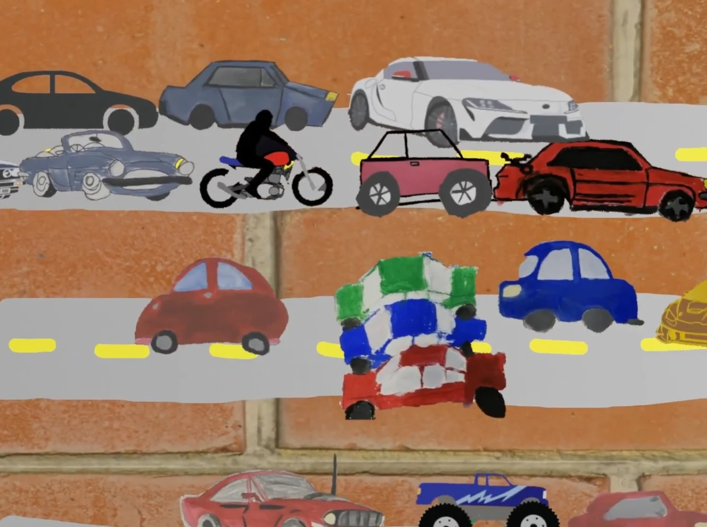

## Materials

[Report](https://leocarletto.github.io/INMETRO_PBEV2026_eda/relatorio.html){.btn .btn-primary role="button" target="_blank"}
[Repository](https://github.com/Leocarletto/INMETRO_PBEV2026_eda){.btn .btn-outline-primary role="button" target="_blank"}
[Apresentation](https://github.com/Leocarletto/INMETRO_PBEV2026_eda){.btn .btn-outline-primary role="button" target="_blank"}

{fig-alt="Cover of the INMETRO PBEV 2026 vehicular CO₂ EDA report"}
